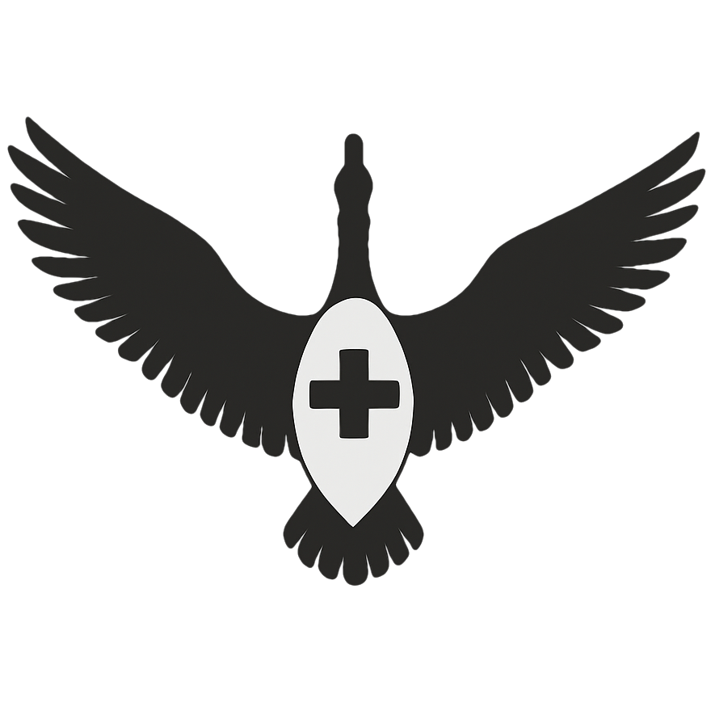
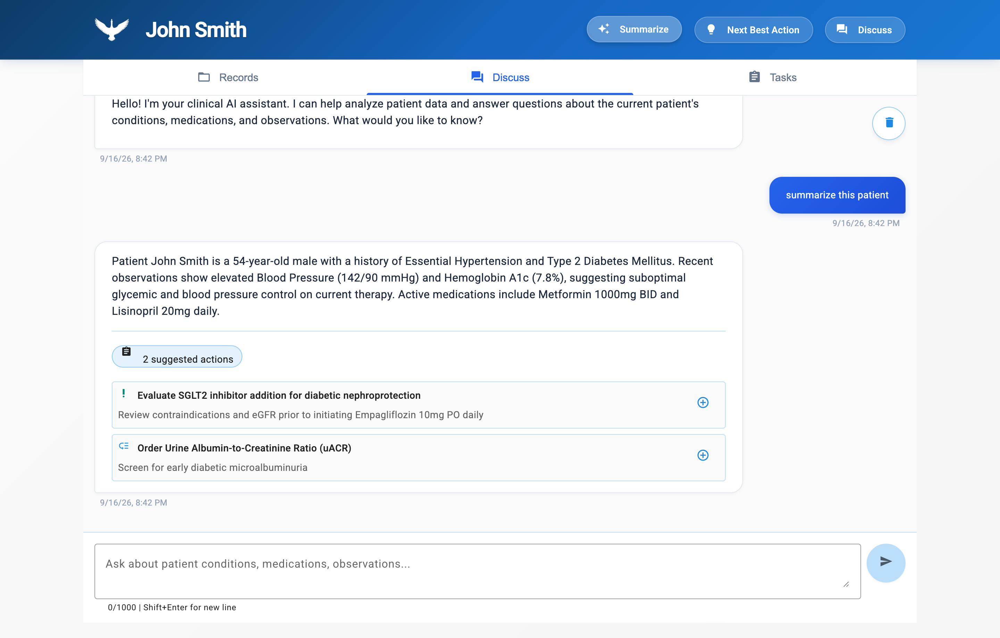
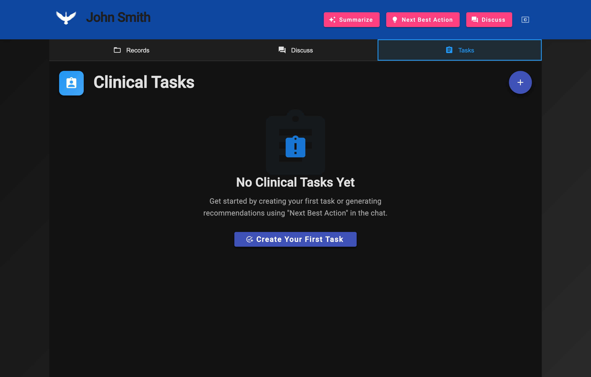
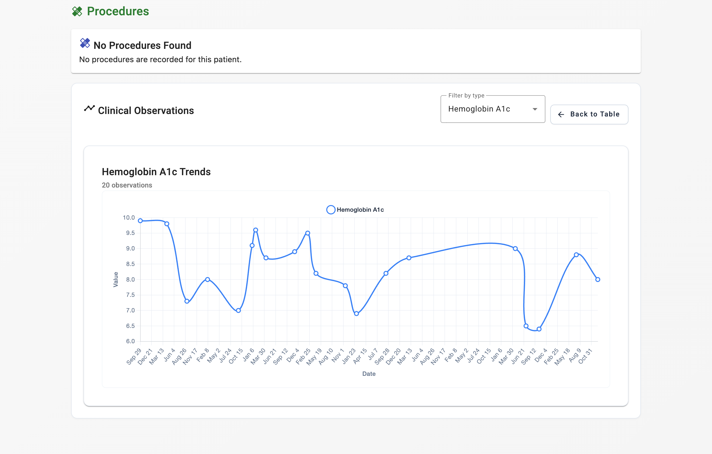
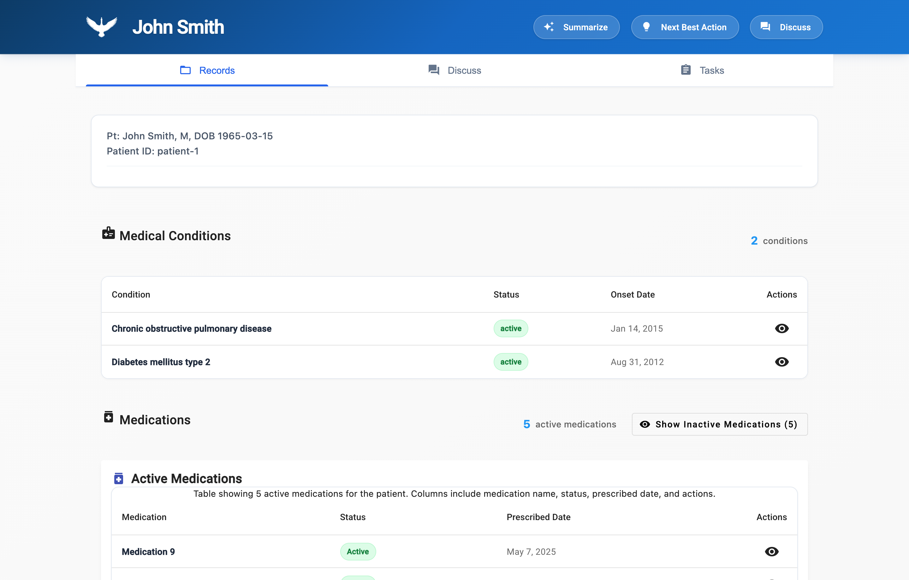
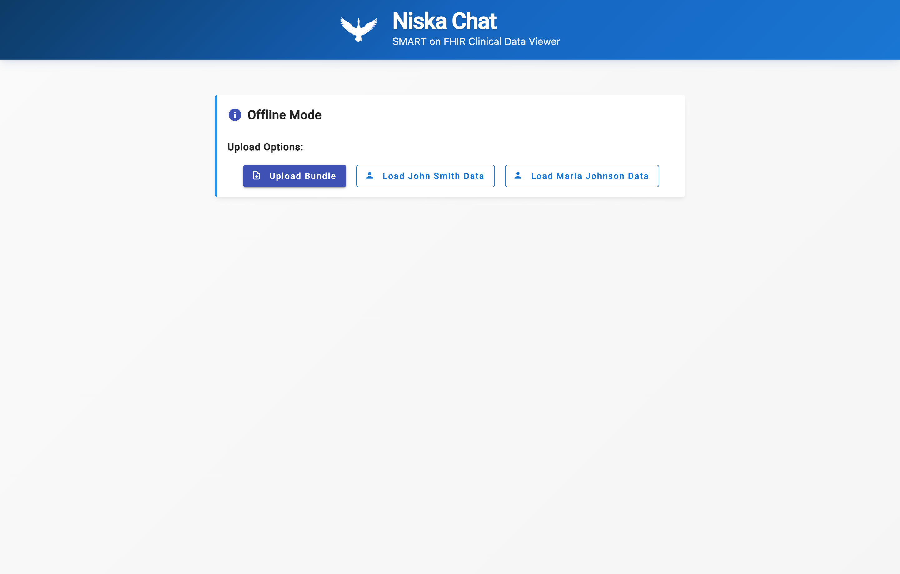

# NiskaChat: FHIR Bundle Viewer & SMART on FHIR App

**NiskaChat** is a modular, standards-compliant, and test-driven web application that enables clinicians and patients to securely view clinical data from FHIR repositories. Built with an Angular frontend and a Node.js/Express backend, NiskaChat supports SMART on FHIR authentication, structured FHIR resource views, charting of observations, and optional LLM-powered summarization and chat.

## 🌐 Project Overview

<p align="center">
  <picture>
    <source media="(prefers-color-scheme: dark)" srcset="src/assets/niska-logo-dark.png">
    <source media="(prefers-color-scheme: light)" srcset="src/assets/niska-logo.png">
    
  </picture>
</p>

Niska Chat draws its name from the Indigenous Cree word niska (“goose”). Just as geese fly in cooperative V-formation, the app promotes shared direction and mutual support among clinicians and patients. Geese navigate with an innate magnetic compass, mirroring the platform’s goal of steering users confidently through complex health data. Niska Chat was built in Calgary on the traditional territories of Treaty 7: the Blackfoot Confederacy (Siksika, Piikani, Kainai), the Tsuut’ina Nation, the Stoney Nakoda Nations, and the Métis Nation of Alberta, Region 3.

NiskaChat is designed for:

- **Clinicians** reviewing longitudinal patient data
- **Care coordinators** managing multi-provider care plans
- **Future agentic capabilities** for interpreting and guiding health actions

Initial data sources include the SMART Sandbox and static FHIR Bundle uploads, with future support for the Google Cloud Healthcare API, Aidbox, or integration into SMART compliant EHRs such as Epic and Oracle.

---

## 📸 Application Showcase

|                Clinical AI Assistant & Suggested Actions                |               FHIR CarePlan & Clinical Tasks Management               |
| :---------------------------------------------------------------------: | :-------------------------------------------------------------------: |
|  |  |

|            Longitudinal Observation Trends (Chart.js)             |             Patient Overview & Medical Records              |
| :---------------------------------------------------------------: | :---------------------------------------------------------: |
|  |  |

|                 Privacy-First Offline FHIR Ingestion                  |
| :-------------------------------------------------------------------: |
|  |

---

## ⚙️ Tech Stack

| Layer                 | Tech                                                                                                                       |
| :-------------------- | :------------------------------------------------------------------------------------------------------------------------- |
| **Frontend**          | Angular 20 (Standalone Components), Angular Material 20, Chart.js 4, fhirclient.js                                         |
| **Backend**           | Node.js 22 + Express, Helmet, Express Session, PKCE OAuth2                                                                 |
| **Standards**         | HL7 FHIR R4, US Core, SMART on FHIR App Launch Framework                                                                   |
| **AI Providers**      | **OpenRouter** (Unified Claude/Llama/DeepSeek), **Ollama** (Local/Offline Private AI), **Claude Haiku**, **Google Gemini** |
| **Testing & Quality** | Jest, Jasmine/Karma, ESLint 9, Stylelint, Pa11y (WCAG 2.1 AA)                                                              |

---

## 🔐 Key Features

- **SMART on FHIR OAuth2 Login**: Secure PKCE flow supporting EHR Launch and Standalone Launch.
- **Privacy-First Offline Mode**: Ingest and explore synthetic FHIR Bundles (Synthea) with zero network egress.
- **Longitudinal Clinical Charting**: Interactive time-series trends for Vitals, Labs (HbA1c, BP, Glucose) with Chart.js.
- **Next Best Action AI Engine**: Translates conversational clinical summaries into structured **FHIR CarePlan** and **FHIR Task** resources.
- **Multi-Provider LLM Gateway**: Seamlessly switch between OpenRouter, local air-gapped Ollama models, or direct vendor APIs with automatic fallback.
- **Accessibility**: Full WCAG 2.1 AA compliance verified with automated Pa11y/Axe audits.

---

## 🚀 Getting Started

### Prerequisites

- Node.js 20+ (Node 22 recommended)
- Angular CLI

### Setup

```bash
# Clone the repository
git clone https://github.com/dylanmarks/niskachat.git
cd niskachat

# Install dependencies
npm install
```

### Configuration

Copy the example environment configuration:

```bash
cp .env.example .env
```

Configure your preferred LLM provider in `.env`:

```env
# Choose provider: openrouter | ollama | claude-haiku | gemini-vertex
LLM_PROVIDER=openrouter

# If using OpenRouter (Recommended - access Claude, Llama 3.3, etc. with one key):
OPENROUTER_API_KEY=your_openrouter_key

# If using local Ollama (100% private, zero-egress offline inference):
# OLLAMA_BASE_URL=http://127.0.0.1:11434
# OLLAMA_MODEL=llama3.1:8b

SESSION_SECRET=dev-secret-change-in-production
CORS_ORIGINS=http://localhost:4200
```

### Running the Application

```bash
# Run both backend and frontend concurrently:
npm run start:dev

# Or run separately:
npm run start:backend # Express API on port 3000
npm start             # Angular dev server on port 4200
```

Open `http://localhost:4200/` in your browser.

- **Offline Mode**: Click "Load John Smith Data" or "Load Maria Johnson Data" to instantly explore clinical data without connecting to an EHR.
- **SMART Sandbox Mode**: Launch via the [SMART Health IT Launcher](https://launch.smarthealthit.org/?launch_url=http%3A%2F%2Flocalhost%3A4200%2F&launch=WzAsImJhYjdmYmJlLTliODQtNGIyYi1iNTQxLWJiMWZlNzY5NzcyYSIsIjFjYjUxMTU3LTgwODMtNDEwZi04N2QxLTA3YTk0NjI5MjIyYSIsIkFVVE8iLDAsMCwwLCIiLCIiLCIiLCIiLCIiLCIiLCIiLDAsMSwiIl0) to test EHR practitioner launch workflows.

### Capturing Fresh UI Screenshots

To re-generate portfolio screenshots automatically using headless Chrome:

```bash
node scripts/capture-screenshots.mjs
```
