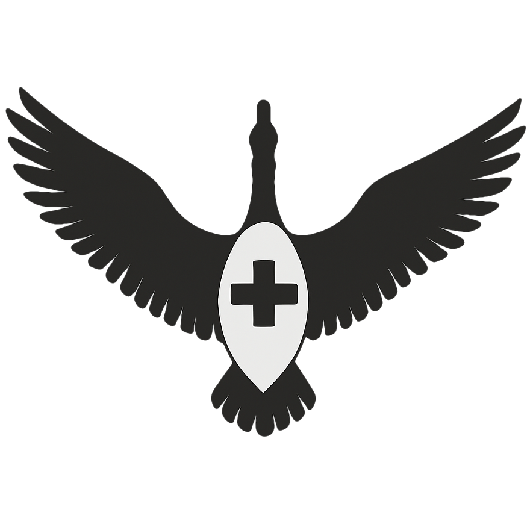
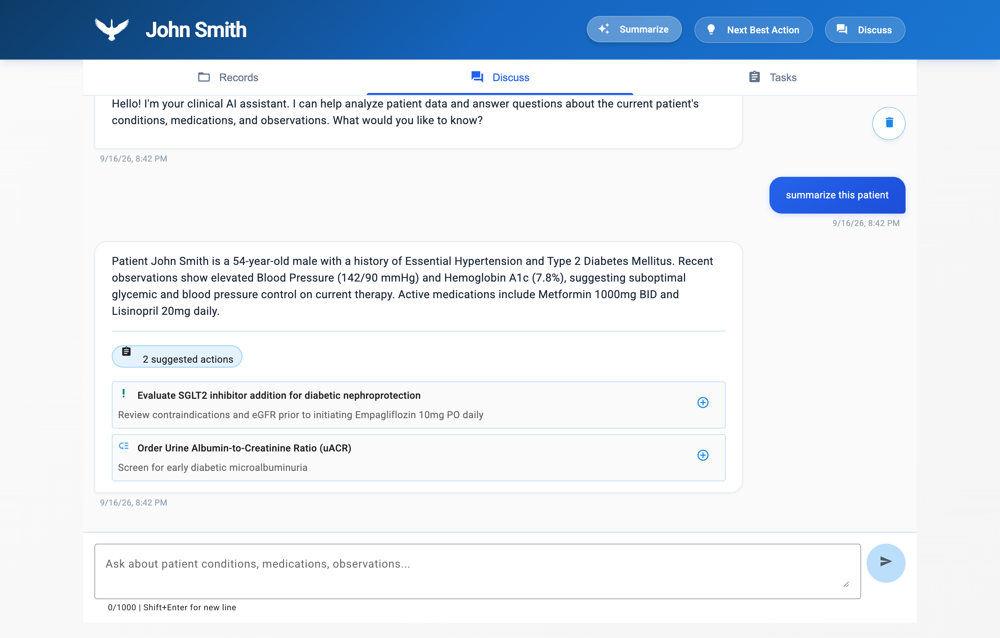
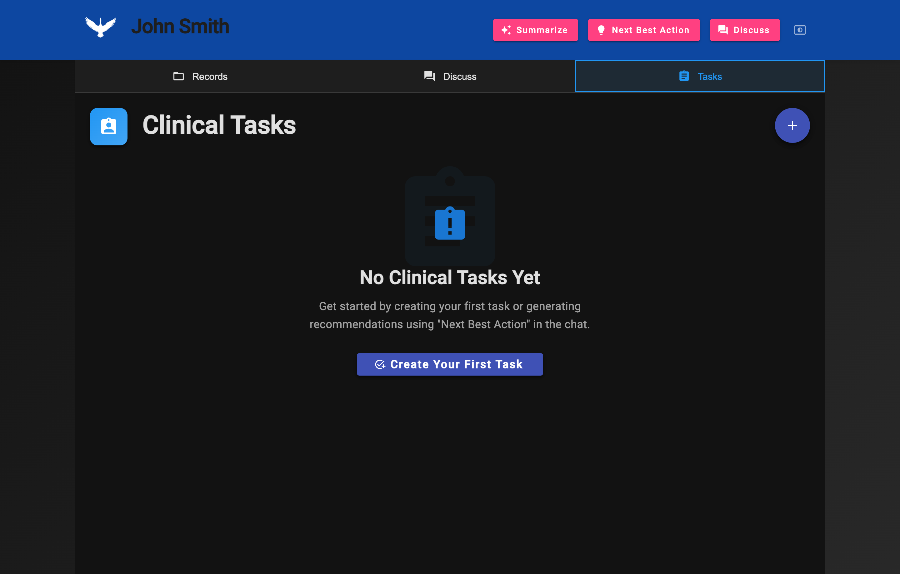
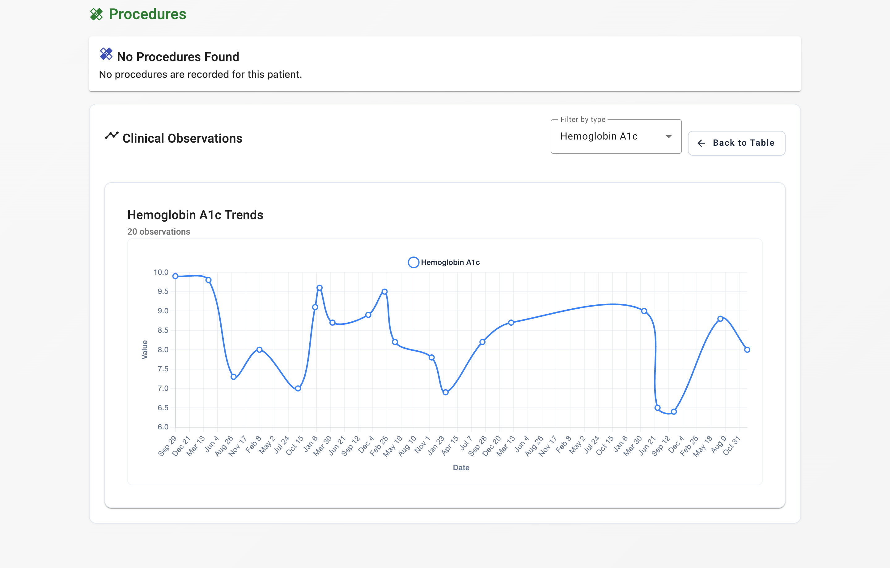
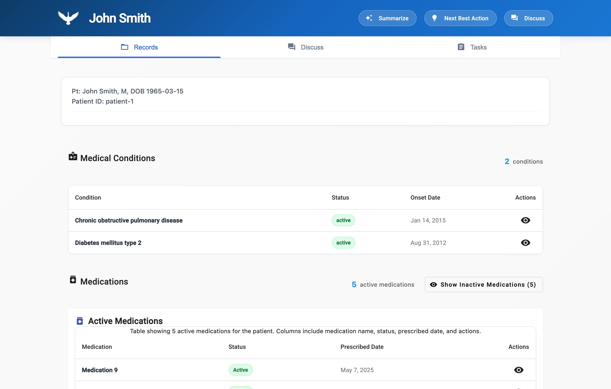

# NiskaChat

NiskaChat is an open-source reference application for exploring healthcare
interoperability workflows. It combines a SMART on FHIR launch flow, FHIR R4
resource views, longitudinal observation charts, session-scoped clinical tasks,
and an optional LLM adapter layer.

The project is intended for developers learning or prototyping health-tech
integrations. It is not a medical device, clinical decision support system, or
production EHR integration.

<p align="center">
  <picture>
    <source media="(prefers-color-scheme: dark)" srcset="src/assets/niska-logo-dark.png">
    <source media="(prefers-color-scheme: light)" srcset="src/assets/niska-logo.png">
    
  </picture>
</p>

The name comes from the Cree word _niska_ (goose). The project was started in
Calgary, on the traditional territories of the Blackfoot Confederacy (Siksika,
Piikani, and Kainai), the Tsuut'ina Nation, the Îyâxe Nakoda Nations, and the
Otipemisiwak Métis Government.

## What the project demonstrates

- A SMART on FHIR authorization-code flow with PKCE and server-side token
  storage.
- Display of Patient, Condition, Observation, MedicationRequest, AllergyIntolerance,
  Immunization, and Procedure resources from FHIR R4 bundles.
- Observation trend visualization using coded clinical data and UCUM units.
- FHIR R4 `Task` and `CarePlan` workflow concepts, including `Task.note`
  annotations and `meta.versionId`-based optimistic concurrency.
- A provider-neutral LLM boundary with OpenRouter, Ollama, Anthropic, and Gemini
  adapters, plus streaming responses over server-sent events.
- A no-account demo path using the example bundles in `examples/fhir-bundles`.

## Screenshots

|                         Clinical discussion                         |                              Task workflow                              |
| :-----------------------------------------------------------------: | :---------------------------------------------------------------------: |
|  |  |

|                        Observation trends                         |                       Patient record                        |
| :---------------------------------------------------------------: | :---------------------------------------------------------: |
|  |  |

## Architecture and trust boundaries

The Angular client renders FHIR data and uses `fhirclient` for the browser-based
SMART launch. The Express backend owns the task demo API and is the only
component that calls model providers. It also contains an experimental
server-side SMART session and FHIR proxy; that path is not yet wired into the
Angular client.

Important limitations:

- The task repository is an in-memory, session-scoped demonstration store. Data
  is lost on restart and is not written back to an EHR or FHIR server.
- The primary browser SMART flow relies on `fhirclient` discovery and browser
  storage. Configure its public client ID and redirect URI in
  `src/environments/environment.ts` before testing a registered client.
- The separate backend SMART/proxy prototype uses endpoints from `.env`; it is
  not a second automatic fallback for the browser flow.
- If an AI feature is used, the app shows the selected provider, model, and
  destination before a request. The send action triggers the call without a
  separate confirmation dialog. It sends the question, recent
  conversation, compressed clinical context, and FHIR source references. It
  does not de-identify data. Ollama inference may still use a remote configured
  endpoint.
- Example bundles are for demonstration only. Do not upload real protected
  health information to a public deployment or send it to a model provider
  without the agreements, consent, security controls, and governance required
  by your jurisdiction and organization.
- AI output is evidence-linked to supplied FHIR resource references where
  possible. Reference matching proves only that a resource exists in the input;
  it does not prove the model interpreted it correctly. AI output is not medical
  advice, diagnosis, treatment guidance, or an order.
- Suggested workflow actions are display-only proposals. A user must review a
  suggestion and explicitly add a separate in-memory demo task; the app does not
  write AI-generated CarePlan or Task resources to an EHR.
- The API still uses anonymous Express sessions and an in-memory task store.
  Authentication, tenant authorization, durable audit, retention, and deployment
  controls are intentionally outside this portfolio proof of concept.

These boundaries are deliberate: the repository shows integration patterns
without claiming production compliance it does not provide.

## Getting started

### Requirements

- Node.js 22
- npm

### Install and run

```bash
git clone https://github.com/dylanmarks/niskachat.git
cd niskachat
npm install
cp .env.example .env
npm run start:dev
```

The Angular app runs at `http://localhost:4200` and the API at
`http://localhost:3000`.

To explore without an EHR connection, load one of the bundled example patient
records from the landing page.

### Configuration

At minimum, set a development session secret:

```env
SESSION_SECRET=replace-with-a-long-random-value
CORS_ORIGINS=http://localhost:4200
```

LLM features are optional. Select one provider:

```env
# openrouter | ollama | claude-haiku | gemini-vertex
LLM_PROVIDER=ollama
OLLAMA_BASE_URL=http://127.0.0.1:11434
OLLAMA_MODEL=llama3.1:8b
```

For the experimental backend SMART/proxy path, configure the registered client,
endpoints, and exact allowed issuer URLs:

```env
SMART_CLIENT_ID=your-registered-client-id
SMART_REDIRECT_URI=http://localhost:3000/auth/callback
SMART_AUTH_URL=https://launch.smarthealthit.org/v/r4/auth/authorize
SMART_TOKEN_URL=https://launch.smarthealthit.org/v/r4/auth/token
SMART_FHIR_BASE_URL=https://launch.smarthealthit.org/v/r4/fhir
SMART_ALLOWED_ISSUERS=https://launch.smarthealthit.org/v/r4/fhir
```

See [the provider setup guide](docs/llm-provider-setup.md) for provider-specific
variables and [the clinical AI safety notes](docs/clinical-ai-safety.md) for
request flow, output validation, and the remaining proof-of-concept limits.

## Quality checks

```bash
npm run lint:all
npm run test:ci
npm run test:backend
npm run build
```

The repository uses strict TypeScript compilation, ESLint, Stylelint, Prettier,
Jasmine/Karma, Jest, CodeQL, and Dependabot. Warnings are tracked technical debt,
not evidence of clinical validation.

## Project status

NiskaChat is a portfolio and community reference project under active
development. The [roadmap](roadmap/roadmap.md) distinguishes implemented demo
features from work needed for durable persistence, broader SMART compatibility,
terminology handling, accessibility verification, and deployment hardening.

Contributions are welcome. Start with [CONTRIBUTING.md](CONTRIBUTING.md), and use
synthetic or fully de-identified data in issues and pull requests.

## License

See [LICENSE.txt](LICENSE.txt).
